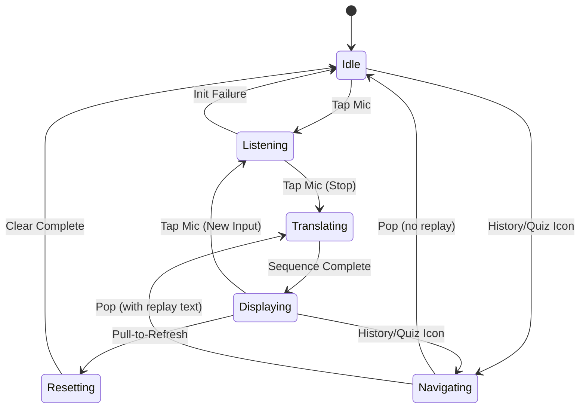

# Project Report 10

## State Transition Modeling

The application state machine focuses on the primary lifecycle within `SpeechScreen`. Other screens (History, Quiz) are transient modal/pushed states that return control to the primary screen.

### Core States

1. Idle: Awaiting user interaction; translation panel shows prompt.
2. Listening: Active speech recognition session; glowing mic, listening banner.
3. Translating: Post-listen processing of token sequence and asset rendering.
4. Displaying: Completed mapping; static last frame visible; user may trigger TTS or replay.
5. Resetting: Refresh gesture invoked; returns to Idle after clearing variables.
6. Navigating: Temporarily on History or Quiz screens (substate outside main pipeline); returns to previous state context (usually Idle or Displaying).

### State Transition Diagram

### State Variable Mapping

- `_isListening` governs Listening vs non-Listening states.
- `_isTranslating` distinguishes Translating overlay from other non-Listening states.
- `_text`, `_originalText`, `_displaytext` store progression of speech → translated → rendered sequence text.
- `_state` integer increments to force AnimatedSwitcher key changes (visual progression).
- `_displaySpeed` influences temporal pacing but not high-level state transitions.

### Reliability and Smooth State Management

Mechanisms ensuring consistency:

- Atomic Transition: Listening stop sets both `_isListening=false` and `_isTranslating=true` before launching async translation loop, preventing overlapping user actions.
- Async Sequencing: Each awaited delay ensures serial frame updates—no race conditions with overlapping GIFs.
- Refresh Isolation: `_resetTranslation()` sets defaults and delays 500ms, preventing partial residual display artifacts.
- History Replay: Replayed text triggers translation identical to fresh session; unifies code path and lowers error surface.

### Failure Handling Paths

- Speech Engine Unavailable: Prevents transition to Listening (stays Idle); feedback logged (could be surfaced visually in future).
- Translation Exception: Catches error, uses original text; state machine proceeds to Translating then Displaying seamlessly.
- Missing Asset: ErrorBuilder returns placeholder icon; no state disruption.

### Opportunities for Enhancement

- Introduce explicit enumerated state variable (e.g., `enum ScreenState { idle, listening, translating, displaying }`) to improve readability and guard transitions.
- Guard Rapid Mic Taps: Debounce to avoid quick flicker between Listening/Translating.
- Cancellation: Provide ability to abort mid-translation sequence (currently sequential delays must finish).
- Parallel Preloading: Preload next asset while current is displayed to smooth transitions for future larger vocabularies.

### Mermaid Timeline of a Typical Session

```mermaid
gantt
  dateFormat  HH:mm:ss
  axisFormat  %S
  section Session
  Idle            :active, 00:00:00, 2s
  Listening       : 00:00:02, 4s
  Translating     : 00:00:06, 6s
  Displaying      : 00:00:12, 5s
```

(Note: Durations illustrative; actual translation length depends on token count and speed factor.)

## Conclusion

The current implicit state machine is simple yet robust for the MVP feature set, relying on boolean flags and a translation loop. Formalizing state with an enum and adding cancellation would prepare the architecture for scaling (e.g., longer phrases, dynamic asset loading). Reliability stems from serialized operations and constrained mutable variables, delivering smooth user experience across listening, translating, and display phases.
