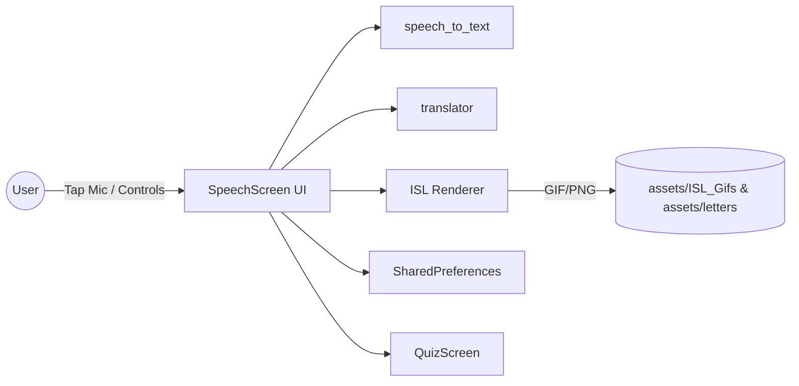
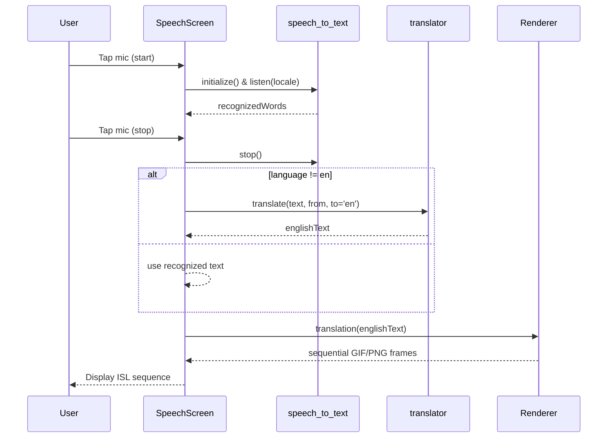

# Project Report 5

## Use Case Modeling

### Actors

- User: The only explicit actor. Initiates listening, adjusts settings, views history, takes quiz, plays TTS.
- System (implicit): Speech recognizer, translator, TTS engine, asset renderer, and persistence layer.

No Admin/Guest roles exist in the current codebase.

### System Boundary

The mobile app operating on-device with optional calls to a translation service. No server-side components are part of the deployed system.

### Use Case List

1. Start Listening and Translate
2. Adjust Playback Speed
3. View and Replay History
4. Play TTS for Current Text
5. Take ISL Quiz

### Use Case Relationships

- "Start Listening and Translate" includes optional "Translate non-English to English".
- "View and Replay History" extends "Start Listening and Translate" by feeding previous text into the translation pipeline.

### Use Case Descriptions

#### UC1: Start Listening and Translate

- Trigger: User taps mic.
- Basic Flow: Initialize STT → capture words → stop → persist → `translation()` maps sequence → render.
- Alternate: If `_selectedLanguage != 'en'`, translate via `translator` prior to mapping.
- Exceptions: STT unavailable; translator failure (fallback to original text).

#### UC2: Adjust Playback Speed

- Trigger: User drags slider.
- Effect: `_displaySpeed` updated; `translation()` uses modified delays.

#### UC3: View and Replay History

- Trigger: User taps History icon; selects entry; returns to SpeechScreen.
- Effect: Replays translation for chosen text.

#### UC4: Play TTS

- Trigger: User taps speaker icon.
- Effect: `_tts.speak(_text)` outputs English speech.

#### UC5: Take ISL Quiz

- Trigger: User taps Quiz icon.
- Effect: Ten questions cycle; final dialog reports score and optional replay.

### User Interactions

- Registration: Not applicable.
- Viewing Data: History list with rank numbering and replay action.
- Notifications: Not applicable.
- Admin Functions: Not applicable.

