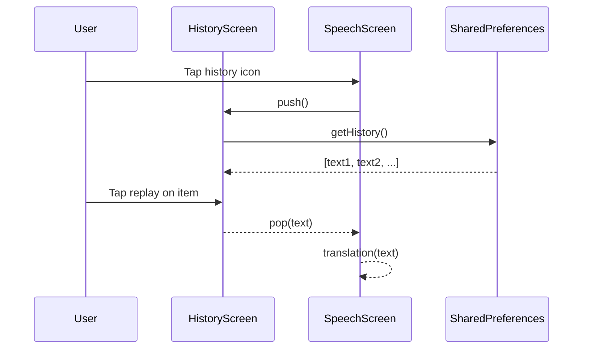
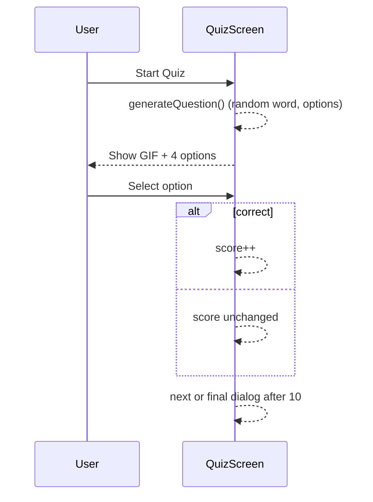
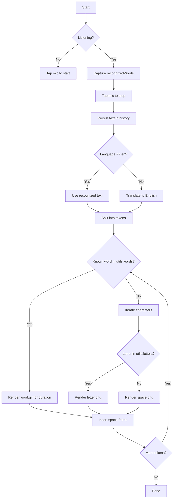
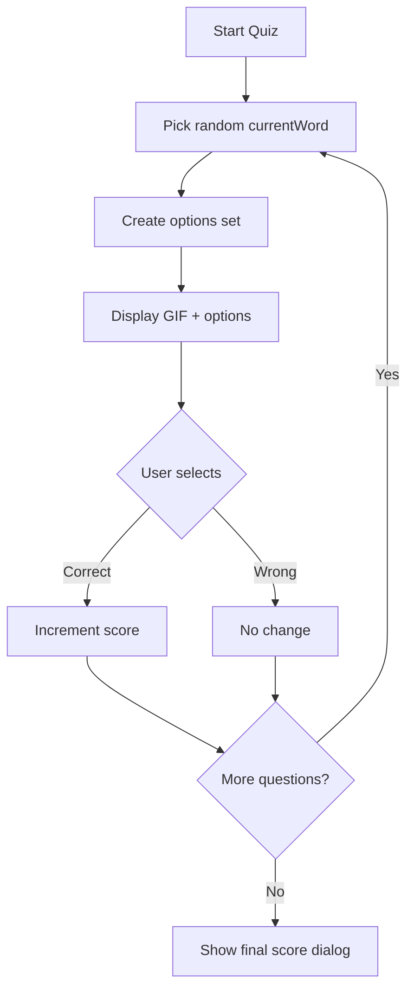

# Project Report 6

## Diagrams for Major Workflows

### 1) Sequence: Listen → Translate → Render

```mermaid
sequenceDiagram
  autonumber
  participant U as User
  participant UI as SpeechScreen
  participant STT as speech_to_text
  participant TR as translator
  participant PREF as SharedPreferences
  participant R as ISL Renderer

  U->>UI: Tap mic (start)
  UI->>STT: initialize(); listen(localeId)
  STT-->>UI: recognizedWords (interim/final)
  U->>UI: Tap mic (stop)
  UI->>STT: stop()
  UI->>PREF: saveTranslation(text)
  alt selectedLanguage != 'en'
    UI->>TR: translate(text, from=lang, to='en')
    TR-->>UI: translatedText
  else
    UI-->>UI: use text as translatedText
  end
  UI->>R: translation(translatedText)
  loop tokens
    R-->>UI: update frame (GIF if known; else letters)
  end
```

### 2) Sequence: History Replay



### 3) Sequence: Quiz Answer Flow



## Activity Diagrams

### A) Activity: Translation Pipeline



### B) Activity: Quiz Round



## Notes on Non-Applicable Flows

- Login and Notifications are not part of the current codebase; no sequence or activity diagrams are included for them to avoid misrepresenting functionality.
