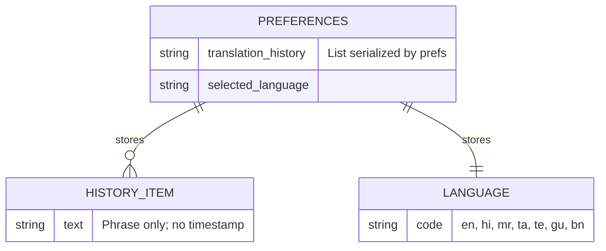

# Project Report 7

## Data Model and Persistence

This project does not use a relational or document database. All persistence is local via `SharedPreferences` with two keys:

- `translation_history` → List<String> of recent unique phrases (most-recent-first, max length 20). No timestamps or IDs are stored.
- `selected_language` → String language code (e.g., `en`, `hi`, `mr`, ...).

The ISL vocabulary and durations are encoded in code (`utils.dart`) and assets on disk:

- `utils.words`: flat array of [word, durationMs] pairs.
- `utils.hello` and `utils.you`: variant lists mapping to canonical words.
- `assets/ISL_Gifs/<word>.gif` and `assets/letters/<char>.png` + `space.png`.

## Conceptual ER Diagram (for clarity only)

Although no DB exists, the following conceptual diagram illustrates data elements and their relationships in the app.

## Entities, Attributes, Relationships

- Preferences: Not a table, but a key-value store with two entries.
- History Item: Modeled as a string element in an ordered list; uniqueness enforced by remove-then-insert.
- Language: A single scalar code saved/restored on app start.

## Communication Among Components

- `SpeechScreen` calls `HistoryManager.saveTranslation(text)` after stopping listening; later retrieves history via `HistoryManager.getHistory()` when `HistoryScreen` builds.
- `SpeechScreen.translation(text)` is stateless relative to persistence; it relies on `utils.dart` arrays and assets for mapping.
- No interprocess or networked data exchange beyond the translation service used transiently.

## Scalability Considerations

- Vocabulary Scaling: As word list grows, `utils.words` becomes harder to maintain and search. Consider refactoring to a structured map `Map<String, int>` and possibly externalizing to JSON for data-driven updates.
- Asset Storage: Large GIF libraries increase app size. Adopt lazy download packs or vectorized sign representations if available.
- Persistence Evolution: If adding timestamps or per-user attributes, SharedPreferences becomes limiting; migrate to a small local DB (e.g., sqflite) or remote store.
- UI Performance: Longer sequences may benefit from prefetching assets and reducing per-frame `setState` churn with an isolated `ValueListenable`/`Animation` pipeline.

## Data Integrity

- History uniqueness and bounded size are enforced programmatically; failure cases (prefs write errors) are rare and localized. There is no referential integrity to manage because assets are read-only resources and preferences are scalar/list values.
