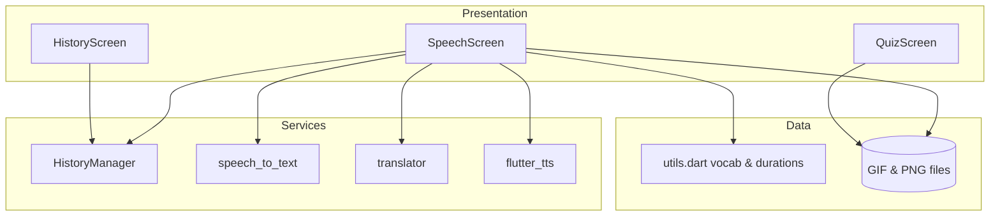
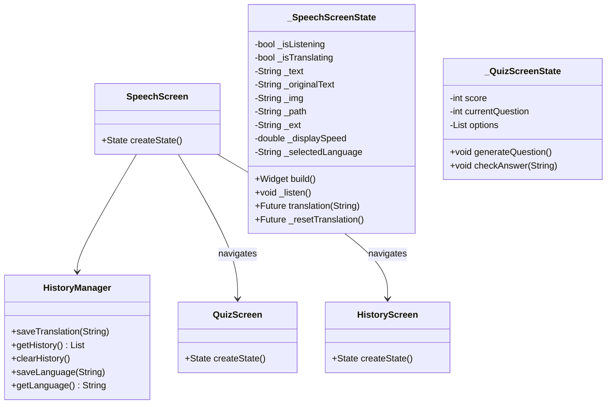
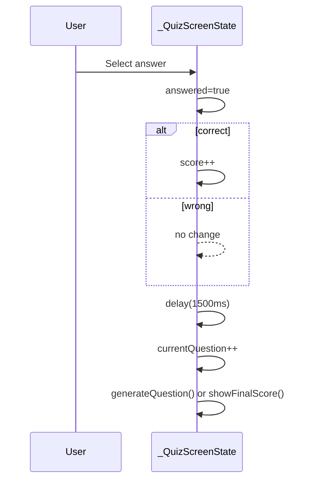

# Project Report 9

## System Design Details

### Layer Overview

- Presentation: StatefulWidgets (`SpeechScreen`, `QuizScreen`, `HistoryScreen`).
- Service-like Helpers: `HistoryManager` (persistence), translator/STT/TTS instances inside `SpeechScreen` state.
- Data Definition: `utils.dart` arrays (words, synonyms, letters) acting as a static in-memory dictionary.
- Assets: GIFs and PNGs forming visualization layer.



### Core Process: Translation Function

Pseudo-contract:

- Input: final recognized English phrase (String).
- Output: Timed sequence of asset frame updates representing ISL signs and letters.
- Error Modes: Missing asset → placeholder icon; unknown token → character fallback.
- Constraints: Sequential, blocking delays (`Future.delayed`) modulated by `_displaySpeed`.

### Detailed Steps (`translation()`)

1. Lowercase input.
2. Split by spaces into tokens.
3. For each token:
   - If present in `utils.words`: parse duration; show corresponding GIF.
   - Else if in synonym arrays (`hello`, `you`): canonicalize → GIF.
   - Else iterate characters:
     - If character in `utils.letters`: show letter PNG.
     - Else show `space.png`.
   - Insert trailing space frame.
4. Advance `_state` to trigger AnimatedSwitcher key change for visual update.

### Quiz Design

- Data Source: `availableWords` local list (subset of vocabulary).
- Generation: Random selection of currentWord + random distinct distractors + optional dummy filler words.
- Answer Evaluation: Immediate color-coded feedback; delay before next question.
- Termination: After `totalQuestions` show summary dialog with contextual encouragement message.

### History Operations

- Save: Remove existing duplicate, insert at index 0, trim >20.
- Retrieve: Return list or empty list.
- Clear: Remove key from preferences.

## UML Diagrams

### Class Diagram (Simplified)



### Sequence Diagram: Quiz Answer (Expanded)



### Process Steps Integration

```mermaid
flowchart LR
  Start[Start App] --> Splash[Animated Splash]
  Splash --> SpeechScreen
  SpeechScreen -->|Tap Mic| Listen[_listen()]
  Listen -->|Stop| Persist[saveTranslation]
  Persist --> Translate[translator (optional)]
  Translate --> Map[translation() token loop]
  Map --> Render[AnimatedSwitcher frames]
  SpeechScreen -->|History Icon| HistoryScreen
  HistoryScreen --> Replay[Select + pop(text)]
  Replay --> Map
  SpeechScreen -->|Quiz Icon| QuizScreen
```

## Detailed Process Steps for Main Functionalities

1. App Launch: Animated splash transitions to `SpeechScreen` with theme pre-configured.
2. Listening Start: Availability checked; locale set; onResult updates interim text shown to user (displaytext mirrors recognized text immediately).
3. Listening Stop: Flags updated; final text persisted; translation sequence initiated.
4. Rendering Loop: Giant switch of asset path/filename variables triggers UI rebuild; `Future.delayed` used for pacing.
5. Replay: HistoryScreen returns selected text; treated identical to new speech input (no translator invocation required unless language context changed).
6. Quiz Flow: Randomization logic ensures variability; answer evaluation is synchronous; progression automated after a timed delay.

## Notes

- No advanced state management (Bloc/Provider); reliance on StatefulWidget callbacks is acceptable at current scale.
- AnimatedSplashScreen and page_transition packages supply UX polish without complicating logic.
